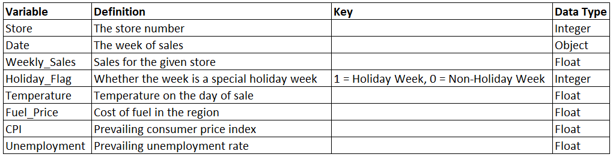
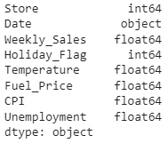
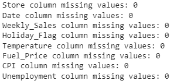
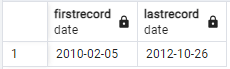
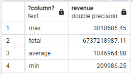
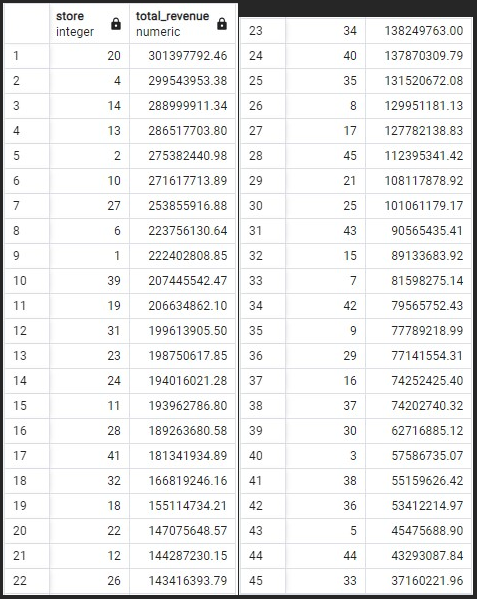

# Walmart Sales Analysis Using Python, SQL, and Excel

## Overview of Analysis

### Purpose

The purpose of this analysis is to gain insights into sales performance, identify areas for improvement, and make data-driven decisions to increase revenue. 

I will seek to answer the following questions:
1. What was the total revenue generated by Walmart during the time period covered by the dataset?
2. Which stores performed best and which stores need improvement?
3. Which variables have an affect on weekly sales?
4. How much do holidays affect weekly sales?

This challenge is from [ProjectPro](https://www.projectpro.io/article/sql-database-projects-for-data-analysis-to-practice/565) and the data is from [Kaggle](https://www.kaggle.com/datasets/yasserh/walmart-dataset).

## Data Dictionary

The dataset provided shows sales data for 45 Walmart stores. The data also provides a 'Holiday_Flag' variable which is a boolean field that shows whether the week is a special holiday week or not. This signifies promotional markdown events throughout the year preceding prominent holidays which include the Super Bowl, Labor Day, Thanksgiving, and Christmas.

The dataset includes 8 variables and 6435 samples.



## Data Cleaning

To prepare the data for importation and analysis in a SQL database, I first inspected the data using Python and cleaned the data as necessary. I used the 'dtypes' attribute to check the datatypes for each variable.



This shows that the 'Date' variable is currently an object type and not datetime. On closer inspection of the dates, there is inconsistent formatting as well. I changed the 'Data' datatype from object to datetime while also standardizing the formatting of the dates.

```
# Change Date datatype from object to date
walmart_data['Date'] = pd.to_datetime(walmart_data['Date'])
```

I then checked for missing values to see if there were any gaps in the data.

```
# Check for missing values
for col in walmart_data.columns.tolist():
  print('{} column missing values: {}'.format(col, walmart_data[col].isnull().sum()))
```



Luckily, there were no missing values in the data. I then checked the 'Holiday_Flag' variable to make sure that it was indeed a boolean field and only held two values.

```
# Check Holiday_Flag unique values
walmart_data['Holiday_Flag'].unique()
```

Since it was a boolean field, I created a new column called 'Holiday_Week' to convert the 'Holiday_Flag' variable from an integer to an object. I replaced the 1 and 0 values with the actual text of what they signified - Holiday Week and Not Holiday Week respectively. I then dropped the 'Holiday_Flag' variable. This will help make the data more readable and easier to understand for data visualizations.

```
# Create new column Holiday_Week to convert Holiday_Flag variable from integer to object, then drop Holiday_Flag
walmart_data['Holiday_Week'] = ''

def applyHoliday(h):
  if h == 1:
    return 'Holiday Week'
  else:
    return 'Not Holiday Week'

walmart_data['Holiday_Week'] = walmart_data['Holiday_Flag'].apply(applyHoliday)

walmart_data = walmart_data.drop('Holiday_Flag', axis=1)
```

Lastly, I checked the dataset for duplicate rows.

```
# Check for duplicate rows
walmart_data[walmart_data.duplicated]
```

Since there were no duplicate rows, I exported the cleaned data to a CSV file. The data is now ready for import into a SQL database.

```
# Export cleaned data to CSV
walmart_data.to_csv('Walmart_Clean.csv', index=False)
```

## Data Exploration

Using PostgreSQL, I created a 'walmartdata' table and then imported the 'Walmart_Clean.csv' file into the table.

```
CREATE TABLE walmartData (
	Store int,
	Date date,
	Weekly_Sales float,
	Temperature float,
	Fuel_Price float,
	CPI float,
	Unemployment float,
	Holiday_Week varchar
)
```

I first wrote a query to see the date range of the dataset.

```
SELECT MIN(date) AS FirstRecord, MAX(date) AS LastRecord FROM walmartdata
```



As we can see, the dataset ranges from January 2010 to December 2012. I then wrote a query to produce some summary statistics using the UNION argument.

```
SELECT 'total', ROUND(SUM(weekly_sales::DECIMAL),2) As revenue
FROM walmartdata
UNION
SELECT 'average', ROUND(AVG(weekly_sales::DECIMAL),2)
FROM walmartdata
UNION
SELECT 'min', min(weekly_sales)
FROM walmartdata
UNION
SELECT 'max', max(weekly_sales)
FROM walmartdata
```



Over the span of the three years, Walmart had a total revenue of $6,737,218,987.11. The minimum weekly revenue was $209,986.25, the maximum was $3,818,686.45, and the average was $1,046,964.88. Next, I looked at the total revenue for each store and sorted the total revenue in descending order to see the how each store performed.

```
SELECT store As Store, ROUND(SUM(weekly_sales::DECIMAL),2) As Total_Revenue
FROM walmartdata
GROUP BY Store
ORDER BY Total_Revenue DESC
```



## Segmentation and Binning

To identify which stores are higher or lower performers than others, I decided to create a new column that would segment the data into four bins by identifying each store as either:
1. High Performance
2. Above Average Performance
3. Below Average Performance
4. Low Performance


